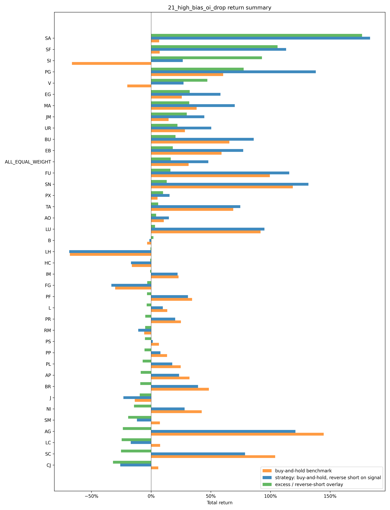
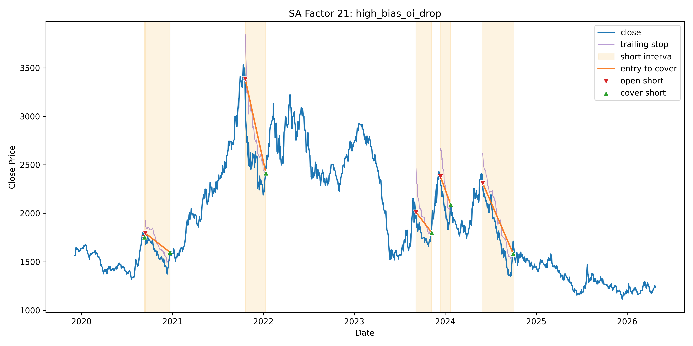
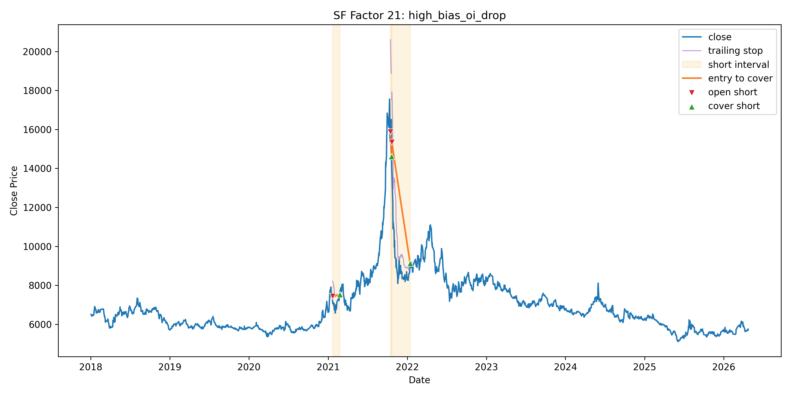
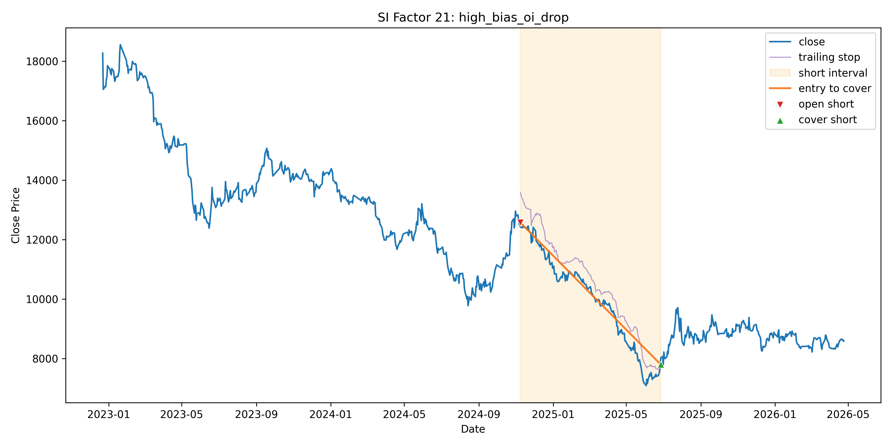
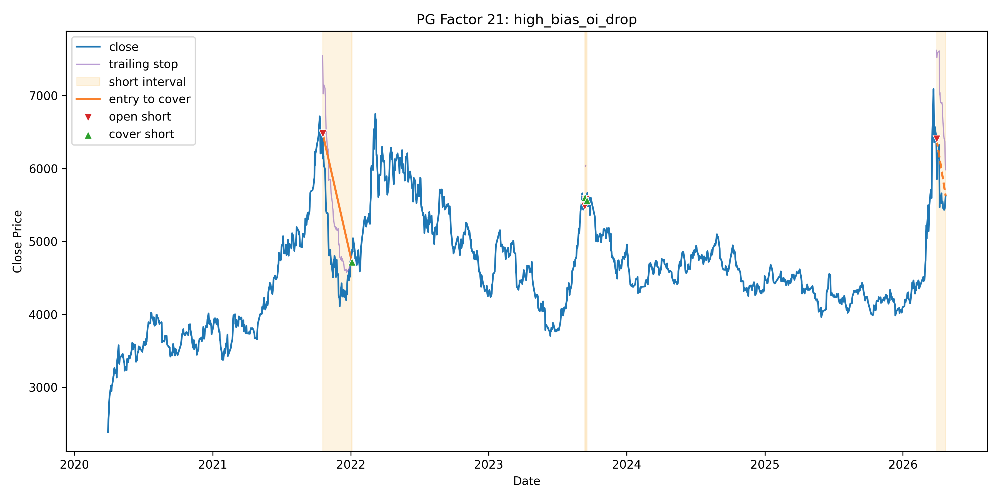
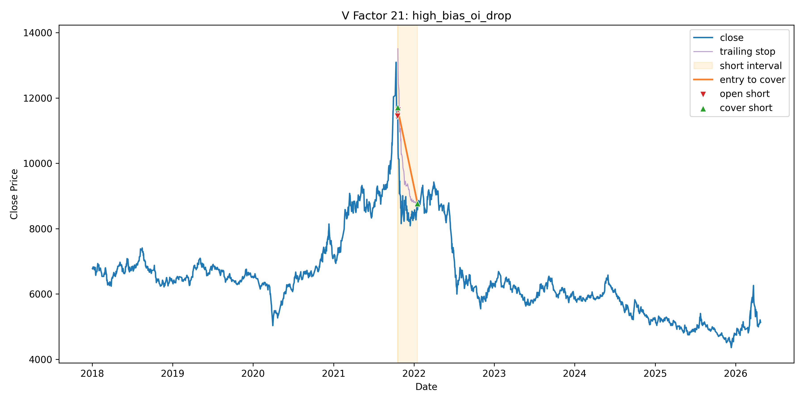
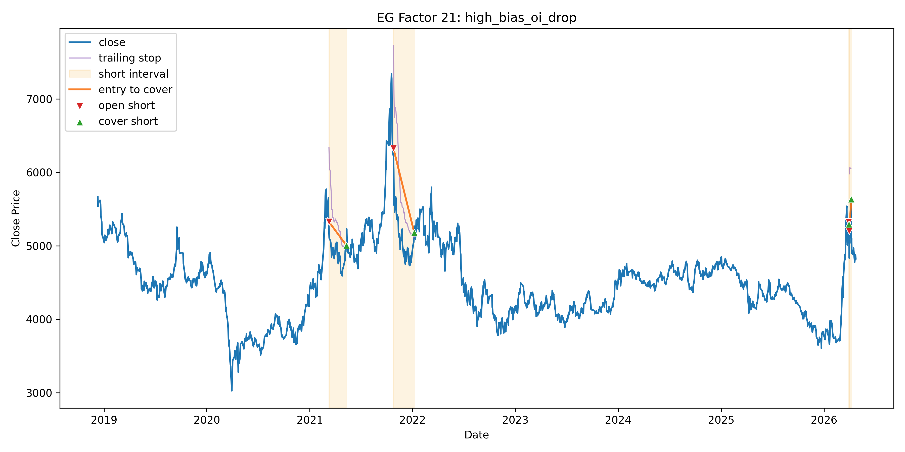

# 21_high_bias_oi_drop 开空和平空逻辑说明

本文档根据 `21_high_bias_oi_drop.py` 中的代码整理，说明该因子的开空、平空条件和主要公式。

## 一句话理解

这个策略寻找的是：

价格均线仍处在较强的多头排列和高乖离状态，但最近一段时间持仓量和收盘价都在走弱。满足这些条件后，策略在下一交易日开盘开空。

持有空单后，如果价格涨回开仓价上方，或者从开仓以来低点明显反弹，就在下一交易日开盘平空。

## 关键参数

| 参数 | 代码值 | 含义 |
| --- | ---: | --- |
| `MA_SHORT_WINDOW` | 5 | 短期均线窗口 |
| `MA_LONG_WINDOW` | 20 | 中期均线窗口 |
| `MA_TREND_WINDOW` | 60 | 长期均线窗口 |
| `MA_BIAS_SPREAD_THRESHOLD` | 0.04 | 5 日和 20 日相关乖离差阈值 |
| `MA_LONG_BIAS_SPREAD_THRESHOLD` | 0.10 | 20 日和 60 日相关乖离差阈值 |
| `REGRESSION_SLOPE_WINDOW` | 7 | 回归斜率窗口，即最近 7 个交易日 |
| `VOLATILITY_WINDOW` | 10 | 波动率窗口 |
| `TRAILING_VOLATILITY_MULTIPLIER` | 4 | 追踪止损波动倍数 |

## 开空条件

设第 `t` 日：

- `C_t`：当日收盘价
- `O_t`：当日开盘价
- `OI_t`：当日持仓量
- `MA5_t`：5 日收盘均线
- `MA20_t`：20 日收盘均线
- `MA60_t`：60 日收盘均线

### 1. 计算价格相对均线的乖离

```text
close_ma5_bias_t  = C_t / MA5_t  - 1
close_ma20_bias_t = C_t / MA20_t - 1
close_ma60_bias_t = C_t / MA60_t - 1
```

### 2. 计算两个乖离差

```text
ma_bias_spread_t      = close_ma20_bias_t - close_ma5_bias_t
ma_long_bias_spread_t = close_ma60_bias_t - close_ma20_bias_t
```

代码要求：

```text
ma_bias_spread_t >= 0.04
ma_long_bias_spread_t >= 0.10
```

直观理解：价格相对不同周期均线的偏离差距要达到固定阈值，说明均线结构拉开，处在较高乖离状态。

### 3. 最近 N 日持仓量回归斜率为负

设 `N = REGRESSION_SLOPE_WINDOW`，当前代码中 `N = 7`。对最近 `N` 个交易日的持仓量做一条回归线：

```text
x = [0, 1, ..., N-1]
y = [OI_{t-N+1}, ..., OI_{t-1}, OI_t]
y = a + b * x
```

斜率 `b` 的计算公式：

```text
b = sum((x_i - mean(x)) * (y_i - mean(y))) / sum((x_i - mean(x))^2)
```

代码要求：

```text
oi_regression_slope_7_t < 0
```

直观理解：最近一段时间持仓量整体方向向下。

### 4. 最近 N 日收盘价回归斜率为负

同样对最近 `N` 个交易日的收盘价做一条回归线：

```text
x = [0, 1, ..., N-1]
y = [C_{t-N+1}, ..., C_{t-1}, C_t]
y = a + b * x
```

代码要求：

```text
close_regression_slope_7_t < 0
```

直观理解：最近一段时间收盘价整体方向向下，短线价格转弱。

### 5. 开空信号总公式

以下条件必须同时满足：

```text
open_short_signal_t =
ma_bias_spread_t >= 0.04
and ma_long_bias_spread_t >= 0.10
and oi_regression_slope_7_t < 0
and close_regression_slope_7_t < 0
```

如果第 `t` 日收盘后生成 `open_short_signal_t = 1`，并且当前为空仓，则在第 `t+1` 日开盘执行开空。

执行开空时：

```text
entry_price = O_{t+1}
position = -1
```

其中 `position = -1` 表示持有空单。

## 平空条件

持有空单后，每天收盘后检查是否需要平空。平空信号同样不是当天立刻执行，而是在下一交易日开盘执行。

设：

- `entry_price`：开空执行价
- `low_since_entry_t`：开空以来的最低价
- `avg_volatility_rate_10_t`：前 10 日平均日内波动率

### 1. 价格涨回开仓价上方

```text
price_above_entry_signal_t = C_t > entry_price
```

直观理解：空单已经被价格反向突破开仓价，触发平空。

### 2. 从开仓以来低点明显反弹

先计算每日波动率：

```text
price_range_rate_t = (high_t - low_t) / C_t
```

再计算前 10 日平均波动率，不包含今天：

```text
avg_volatility_rate_10_t
    = mean(price_range_rate_{t-10}, ..., price_range_rate_{t-1})
```

开空以来最低价：

```text
low_since_entry_t = min(开空以来的低点)
```

追踪平空距离：

```text
trailing_stop_distance_t
    = low_since_entry_t * avg_volatility_rate_10_t * 4
```

追踪平空价：

```text
trailing_stop_price_t
    = low_since_entry_t + trailing_stop_distance_t
```

如果收盘价高于追踪平空价：

```text
trailing_rebound_signal_t = C_t > trailing_stop_price_t
```

直观理解：空单盈利过程中，价格如果从低点向上反弹超过 4 倍近期平均波动，就触发平空，锁定已有收益或控制回撤。

### 3. 平空信号总公式

两个平空条件满足任意一个即可：

```text
cover_short_signal_t =
    price_above_entry_signal_t
or trailing_rebound_signal_t
```

也就是：

```text
cover_short_signal_t =
    C_t > entry_price
or C_t > low_since_entry_t * (1 + 4 * avg_volatility_rate_10_t)
```

如果第 `t` 日收盘后生成 `cover_short_signal_t = 1`，并且当前持有空单，则在第 `t+1` 日开盘执行平空。

执行平空时：

```text
exit_price = O_{t+1}
position = 0
```

其中 `position = 0` 表示空仓。

## 信号和实际交易的时间关系

代码采用“当天收盘后确认信号，下一交易日开盘执行”的方式：

```text
actual_open_short_signal_t = open_short_signal_{t-1}
actual_cover_short_signal_t = cover_short_signal_{t-1}
```

因此：

- 第 `t` 日出现开空信号，实际第 `t+1` 日开盘开空。
- 第 `t` 日出现平空信号，实际第 `t+1` 日开盘平空。
- 初始状态为空仓。
- 只有空仓时才会开空。
- 持有空单时，如果触发平空，平空优先执行。

## 结果














