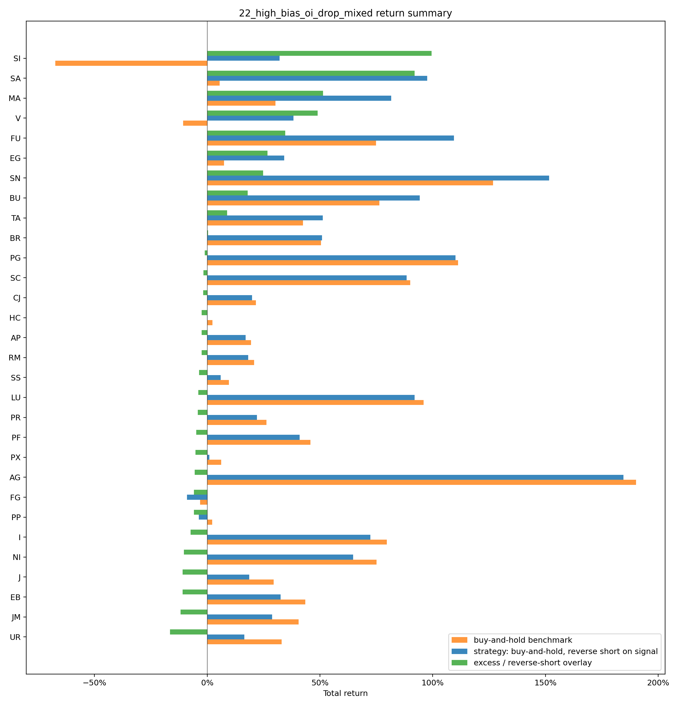
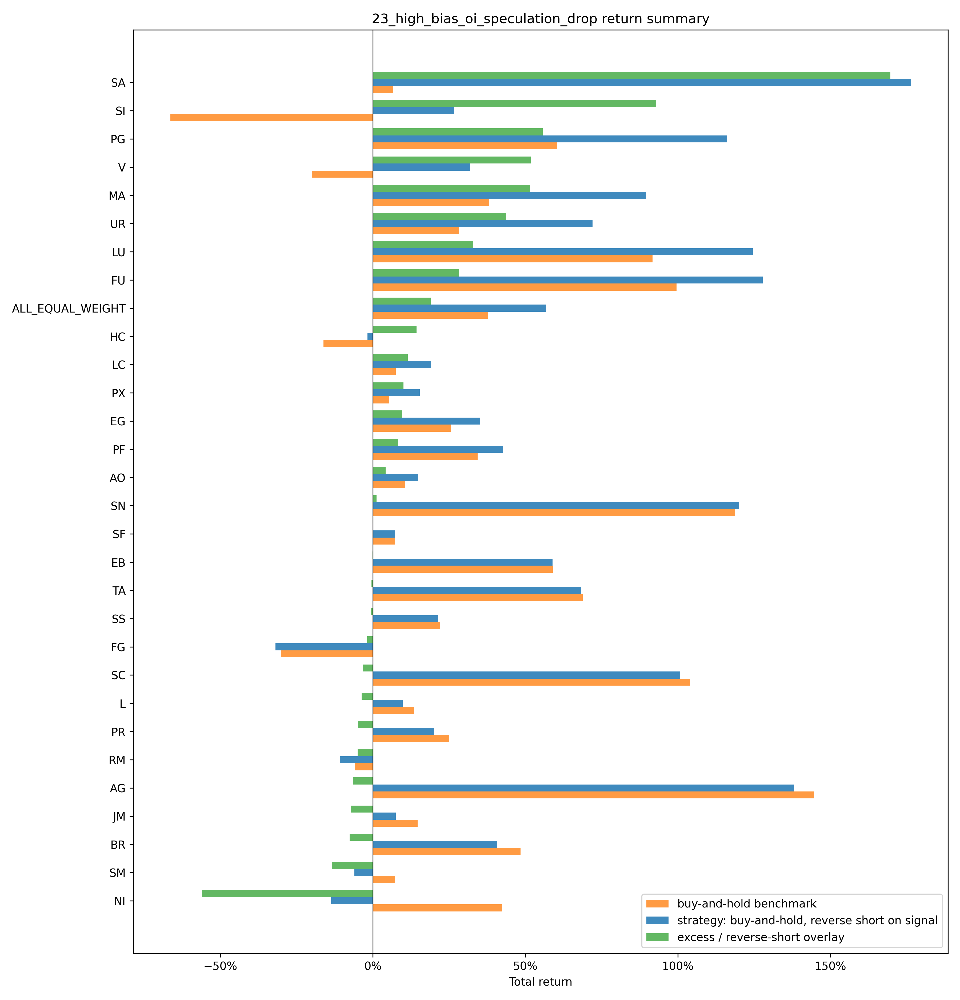
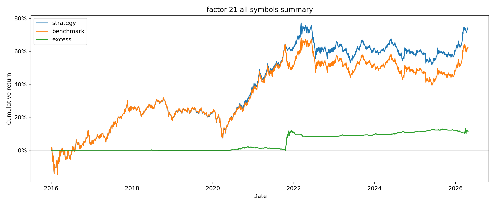
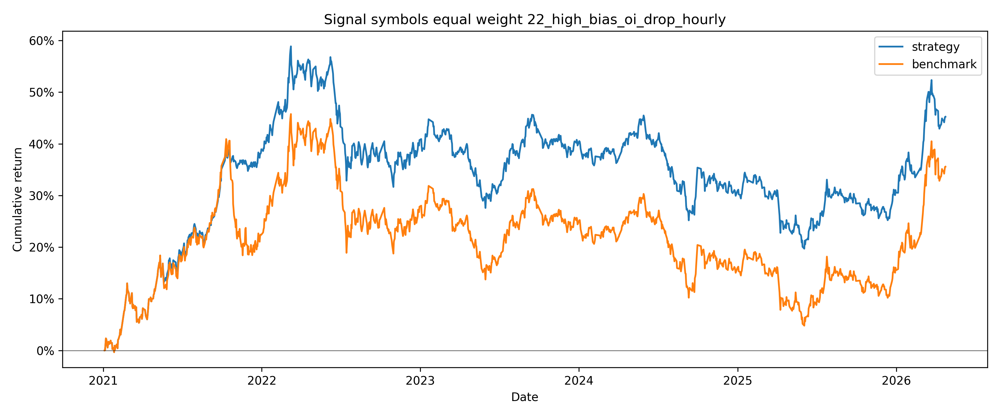
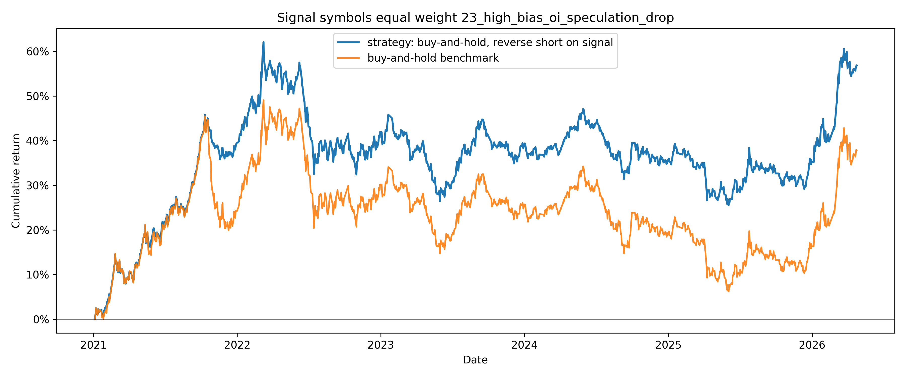

# chapter2 高乖离持仓回落因子开空和平空逻辑说明

本文档根据 `code/chapter2/factors` 中的 21、22、23 号因子代码整理，说明三个因子的开空、平空条件和主要公式。

## 一句话理解

这个策略寻找的是：

价格均线仍处在较强的高乖离状态，但最近一段时间持仓量和收盘价都在走弱。21 号是日频基准版本，22 号改成小时级执行，23 号在 21 号基础上增加投机度回落过滤。

持有空单后，如果价格涨回开仓价上方，或者从开仓以来低点明显反弹，就在下一根可交易 bar 开盘平空。

## 关键参数

| 参数 | 代码值 | 适用因子 | 含义 |
| --- | ---: | --- | --- |
| `MA_SHORT_WINDOW` | 5 | 21/22/23 | 短期均线窗口 |
| `MA_LONG_WINDOW` | 20 | 21/22/23 | 中期均线窗口 |
| `MA_TREND_WINDOW` | 60 | 21/22/23 | 长期均线窗口 |
| `MA_BIAS_SPREAD_THRESHOLD` | 0.04 | 21/22/23 | 5 日和 20 日相关乖离差阈值 |
| `MA_LONG_BIAS_SPREAD_THRESHOLD` | 0.10 | 21/22/23 | 20 日和 60 日相关乖离差下限 |
| `REGRESSION_SLOPE_WINDOW` | 7 | 21 | 持仓量和收盘价共用的回归斜率窗口 |
| `OI_REGRESSION_SLOPE_WINDOW` | 15 | 22 | 持仓量回归斜率窗口 |
| `OI_REGRESSION_SLOPE_WINDOW` | 5 | 23 | 持仓量回归斜率窗口 |
| `CLOSE_REGRESSION_SLOPE_WINDOW` | 7 | 22/23 | 收盘价回归斜率窗口 |
| `SPECULATION_REGRESSION_SLOPE_WINDOW` | 5 | 23 | 投机度回归斜率窗口 |
| `SPECULATION_REGRESSION_SLOPE_THRESHOLD` | -0.01 | 23 | 投机度回归斜率阈值 |
| `VOLATILITY_WINDOW` | 10 | 21/22/23 | 波动率窗口 |
| `TRAILING_VOLATILITY_MULTIPLIER` | 4 | 21/22/23 | 追踪止损波动倍数 |

## 21_high_bias_oi_drop（日频）开空条件

设第 `t` 日：

- `C_t`：当日收盘价
- `O_t`：当日开盘价
- `OI_t`：当日持仓量
- `MA5_t`：5 日收盘均线
- `MA20_t`：20 日收盘均线
- `MA60_t`：60 日收盘均线

### 1. 计算价格相对均线的乖离

```text
close_ma5_bias_t  = C_t / MA5_t  - 1
close_ma20_bias_t = C_t / MA20_t - 1
close_ma60_bias_t = C_t / MA60_t - 1
```

### 2. 计算两个乖离差

```text
ma_bias_spread_t      = close_ma20_bias_t - close_ma5_bias_t
ma_long_bias_spread_t = close_ma60_bias_t - close_ma20_bias_t
```

代码要求：

```text
ma_bias_spread_t >= 0.04
ma_long_bias_spread_t >= 0.10
```

直观理解：价格相对不同周期均线的偏离差距要达到固定阈值，说明均线结构拉开，处在较高乖离状态。

### 3. 最近 N 日持仓量回归斜率为负

设 `N = REGRESSION_SLOPE_WINDOW`，当前代码中 `N = 7`。对最近 `N` 个交易日的持仓量做一条回归线：

```text
x = [0, 1, ..., N-1]
y = [OI_{t-N+1}, ..., OI_{t-1}, OI_t]
y = a + b * x
```

斜率 `b` 的计算公式：

```text
b = sum((x_i - mean(x)) * (y_i - mean(y))) / sum((x_i - mean(x))^2)
```

代码要求：

```text
oi_regression_slope_7_t < 0
```

直观理解：最近一段时间持仓量整体方向向下。

### 4. 最近 N 日收盘价回归斜率为负

同样对最近 `N` 个交易日的收盘价做一条回归线：

```text
x = [0, 1, ..., N-1]
y = [C_{t-N+1}, ..., C_{t-1}, C_t]
y = a + b * x
```

代码要求：

```text
close_regression_slope_7_t < 0
```

直观理解：最近一段时间收盘价整体方向向下，短线价格转弱。

### 5. 开空信号总公式

以下条件必须同时满足：

```text
open_short_signal_t =
ma_bias_spread_t >= 0.04
and ma_long_bias_spread_t >= 0.10
and oi_regression_slope_7_t < 0
and close_regression_slope_7_t < 0
```

如果第 `t` 日收盘后生成 `open_short_signal_t = 1`，并且当前为空仓，则在第 `t+1` 日开盘执行开空。

执行开空时：

```text
entry_price = O_{t+1}
position = -1
```

其中 `position = -1` 表示持有空单。

## 平空条件

持有空单后，每天收盘后检查是否需要平空。平空信号同样不是当天立刻执行，而是在下一交易日开盘执行。

设：

- `entry_price`：开空执行价
- `low_since_entry_t`：开空以来的最低价
- `avg_volatility_rate_10_t`：前 10 日平均日内波动率

### 1. 价格涨回开仓价上方

```text
price_above_entry_signal_t = C_t > entry_price
```

直观理解：空单已经被价格反向突破开仓价，触发平空。

### 2. 从开仓以来低点明显反弹

先计算每日波动率：

```text
price_range_rate_t = (high_t - low_t) / C_t
```

再计算前 10 日平均波动率，不包含今天：

```text
avg_volatility_rate_10_t
    = mean(price_range_rate_{t-10}, ..., price_range_rate_{t-1})
```

开空以来最低价：

```text
low_since_entry_t = min(开空以来的低点)
```

追踪平空距离：

```text
trailing_stop_distance_t
    = low_since_entry_t * avg_volatility_rate_10_t * 4
```

追踪平空价：

```text
trailing_stop_price_t
    = low_since_entry_t + trailing_stop_distance_t
```

如果收盘价高于追踪平空价：

```text
trailing_rebound_signal_t = C_t > trailing_stop_price_t
```

直观理解：空单盈利过程中，价格如果从低点向上反弹超过 4 倍近期平均波动，就触发平空，锁定已有收益或控制回撤。

### 3. 平空信号总公式

两个平空条件满足任意一个即可：

```text
cover_short_signal_t =
    price_above_entry_signal_t
or trailing_rebound_signal_t
```

也就是：

```text
cover_short_signal_t =
    C_t > entry_price
or C_t > low_since_entry_t * (1 + 4 * avg_volatility_rate_10_t)
```

如果第 `t` 日收盘后生成 `cover_short_signal_t = 1`，并且当前持有空单，则在第 `t+1` 日开盘执行平空。

执行平空时：

```text
exit_price = O_{t+1}
position = 0
```

其中 `position = 0` 表示空仓。

## 信号和实际交易的时间关系

21 号和 23 号因子采用“当天收盘后确认信号，下一交易日开盘执行”的方式：

```text
actual_open_short_signal_t = open_short_signal_{t-1}
actual_cover_short_signal_t = cover_short_signal_{t-1}
```

因此：

- 第 `t` 日出现开空信号，实际第 `t+1` 日开盘开空。
- 第 `t` 日出现平空信号，实际第 `t+1` 日开盘平空。
- 初始状态为空仓。
- 只有空仓时才会开空。
- 持有空单时，如果触发平空，平空优先执行。

## 22_high_bias_oi_drop_mixed（小时级）开空条件

22 号因子读取小时数据，但均线、回归斜率和波动率仍按交易日口径计算。每个小时先把当日已发生的小时 bar 累计成一根“截至当前小时”的日 K：

```text
open_t = 当日第一根小时 bar 开盘价
close_t = 当前小时收盘价
high_t = 当日截至当前小时最高价
low_t = 当日截至当前小时最低价
OI_t = 当前小时持仓量
```

当日以前的数据只使用完整交易日，避免引用当前交易日后续小时数据。22 号的开空信号为：

```text
open_short_signal_t =
ma_bias_spread_t >= 0.04
and ma_long_bias_spread_t >= 0.10
and oi_regression_slope_15_t < 0
and close_regression_slope_7_t < 0
```

其中：

```text
ma_bias_spread_t      = close_ma20_bias_t - close_ma5_bias_t
ma_long_bias_spread_t = close_ma60_bias_t - close_ma20_bias_t
```

如果当前小时收盘后生成 `open_short_signal_t = 1`，并且当前为空仓，则在下一小时 bar 开盘开空。

平空逻辑和 21 号一致，但执行频率变为小时级：

```text
cover_short_signal_t =
    close_t > entry_price
or close_t > low_since_entry_t * (1 + 4 * avg_volatility_rate_10_t)
```

其中 `avg_volatility_rate_10_t` 使用前 10 个完整交易日的 `(high - low) / close` 均值。当前小时收盘触发平空后，下一小时 bar 开盘执行平空。

## 23_high_bias_oi_speculation_drop（日频）开空条件

23 号因子是 21 号的增强版本。它仍然是日频信号、下一交易日开盘执行，但有两处变化：

- 持仓量回归窗口从 7 日改为 5 日。
- 增加投机度回落条件，要求最近 5 日投机度回归斜率 `<= -0.01`。

开空信号为：

```text
open_short_signal_t =
ma_bias_spread_t >= 0.04
and ma_long_bias_spread_t >= 0.10
and oi_regression_slope_5_t < 0
and close_regression_slope_7_t < 0
and speculation_regression_slope_5_t <= -0.01
```

其中投机度斜率计算方式和价格、持仓量斜率一致：

```text
x = [0, 1, ..., 4]
y = [speculation_{t-4}, ..., speculation_t]
y = a + b * x
speculation_regression_slope_5_t = b
```

直观理解：23 号不仅要求价格和持仓量同步转弱，还要求投机度出现足够明显的下降，过滤掉只由价格短期回落造成的信号。

平空条件、追踪平空价和 21 号完全一致：

```text
cover_short_signal_t =
    C_t > entry_price
or C_t > low_since_entry_t * (1 + 4 * avg_volatility_rate_10_t)
```

## 结果

以下累计收益和年化收益均按固定初始本金的单利累加口径计算。

| 21 号因子收益汇总 | 22 号因子收益汇总 | 23 号因子收益汇总 |
| --- | --- | --- |
|  |  |  |

| 因子 | 年化收益率 | 最大回撤 | 夏普 |
| --- | ---: | ---: | ---: |
| `21_high_bias_oi_drop` | 7.42% | -18.53% | 0.59 |
| `22_high_bias_oi_drop_mixed` | 9.53% | -22.60% | 0.70 |
| `23_high_bias_oi_speculation_drop` | 7.30% | -18.46% | 0.58 |

### 21_high_bias_oi_drop



### 22_high_bias_oi_drop_mixed



### 23_high_bias_oi_speculation_drop


