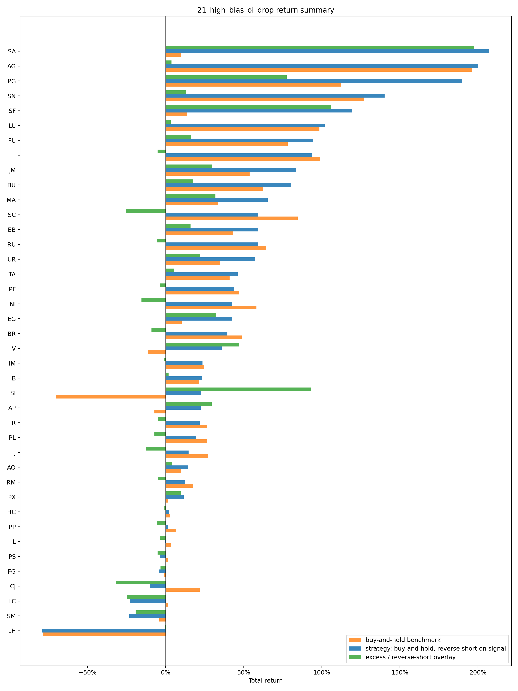
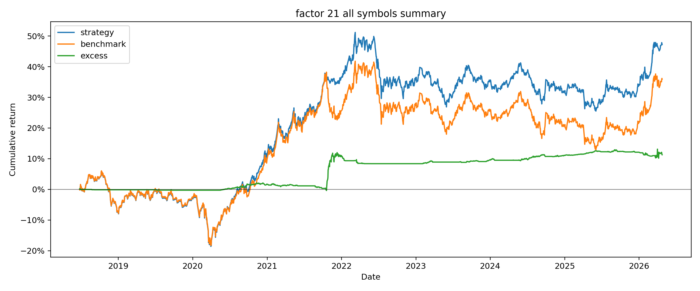
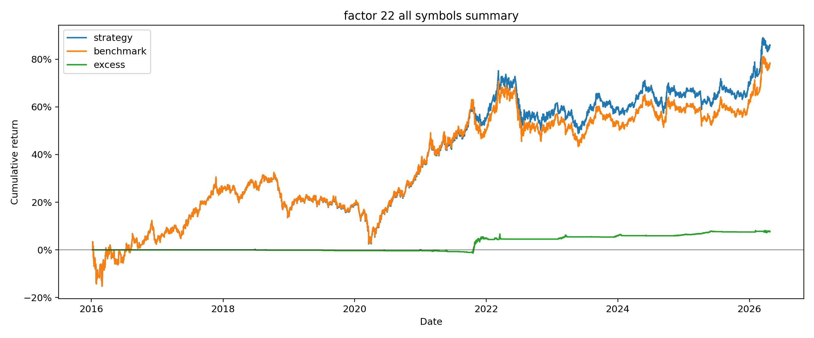
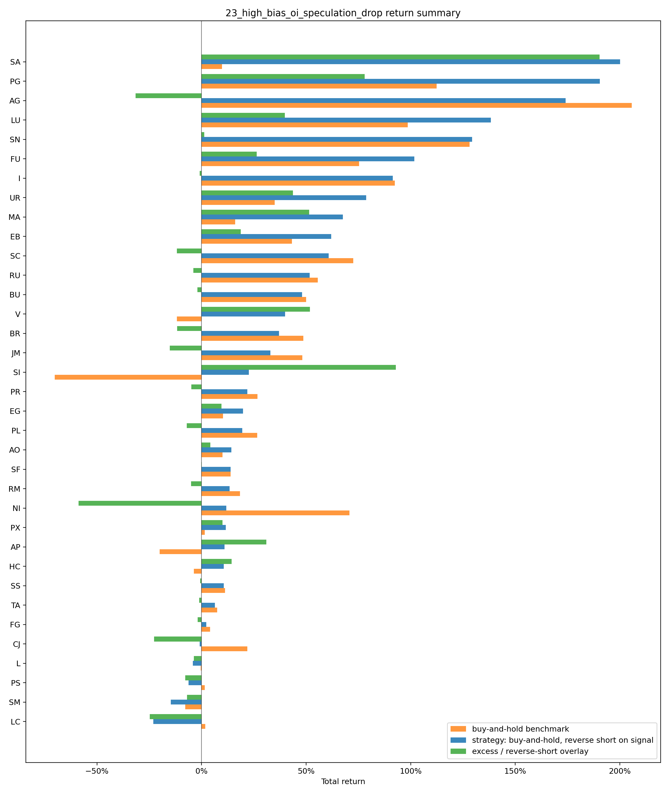
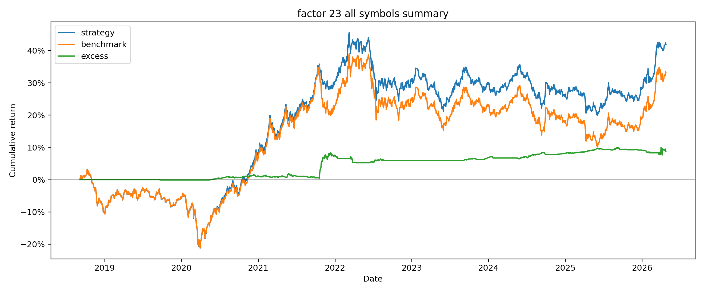
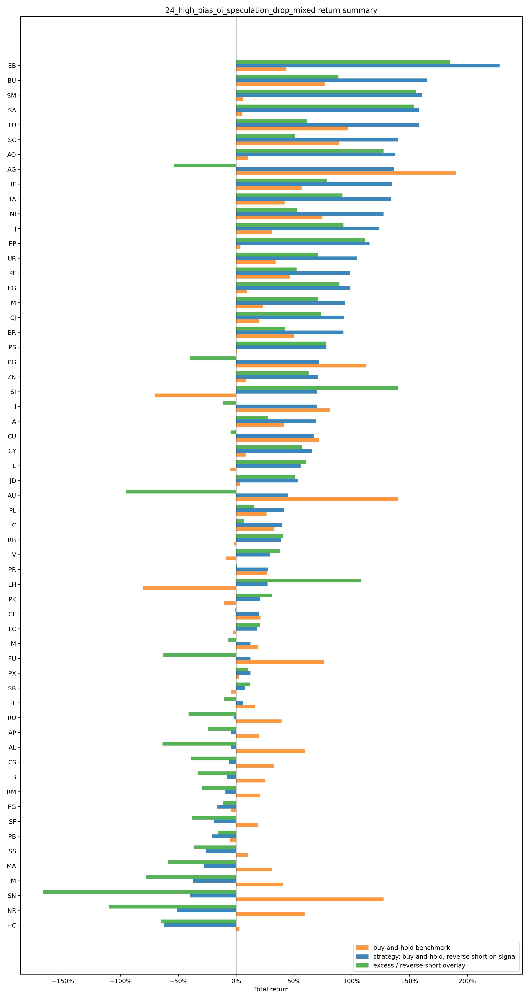
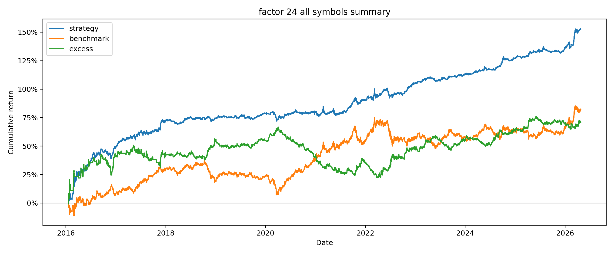
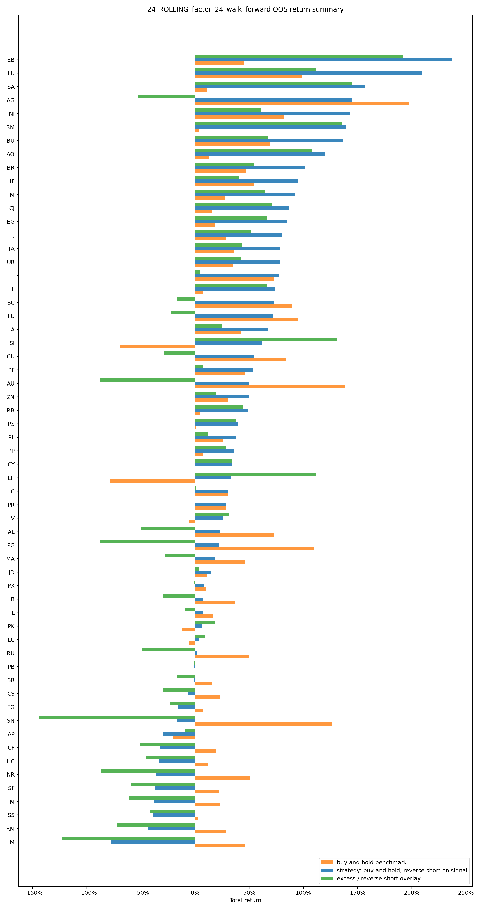
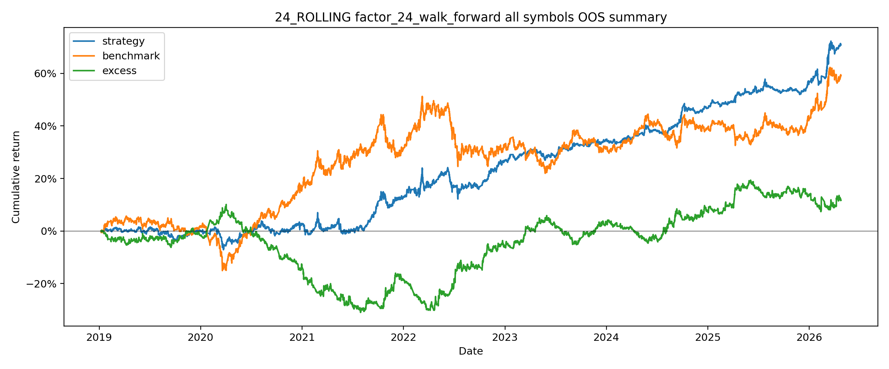

# chapter2 21-24 号因子和 rolling 因子筛选逻辑

本文只说明筛选逻辑和公式，不展开回测收益、图表和代码执行细节。

## 1. 统一公式

所有开仓指标都先在完整日频数据上计算。设第 `d` 个交易日：

- `C_d`：收盘价。
- `H_d`：最高价。
- `L_d`：最低价。
- `V_d`：成交量。
- `OI_d`：持仓量。

如果滚动窗口内历史不够，或者窗口里有缺失值，对应指标就是空值；空值参与条件判断时视为不满足。

### 均线和乖离差

`n` 日均线：

```text
MA(n,d) = (C_d + C_{d-1} + ... + C_{d-n+1}) / n
```

代码先计算收盘价相对三条均线的乖离：

```text
short_bias_d = C_d / MA(short,d) - 1
long_bias_d  = C_d / MA(long,d)  - 1
trend_bias_d = C_d / MA(trend,d) - 1
```

再用两个乖离的差作为筛选指标：

```text
B1_d = long_bias_d - short_bias_d
     = C_d / MA(long,d) - C_d / MA(short,d)

B2_d = trend_bias_d - long_bias_d
     = C_d / MA(trend,d) - C_d / MA(long,d)
```

直观理解：`B1` 看短均线和中均线的距离，`B2` 看中均线和长均线的距离。代码不是直接判断 `C_d` 比某条均线高多少，而是判断这些均线乖离差是否落在指定区间。

### 回归斜率

对任意序列 `X`，最近 `n` 日数据记为：

```text
Y_i = X_{d-n+1+i}, i = 0,1,...,n-1
```

代码用普通最小二乘直线 `Y_i = a + beta * i` 的斜率。实际计算时先把横坐标居中：

```text
x_i = i - mean(0,1,...,n-1)
    = i - (n-1)/2
```

斜率为：

```text
beta(X,n,d)
    = sum(x_i * (Y_i - mean(Y))) / sum(x_i^2)
```

因为 `sum(x_i)=0`，也可以理解为“最近 n 日序列每向前走 1 天，平均变化多少”。如果窗口里任何一个 `Y_i` 是空值，`beta` 就是空值。

代码对持仓量和收盘价不用原始斜率，而是用斜率除以窗口均值：

```text
mean_X(n,d) = (X_d + X_{d-1} + ... + X_{d-n+1}) / n
R(X,n,d)   = beta(X,n,d) / mean_X(n,d)
```

所以：

```text
R(OI,n,d) = 持仓量斜率 / 最近 n 日平均持仓量
R(C,n,d)  = 收盘价斜率 / 最近 n 日平均收盘价
```

这样不同品种、不同价格量级可以放在同一个阈值下比较。例如 `R(C,7,d)<=0.0065` 表示 7 日价格斜率不能超过 7 日均价的 `0.65%`。

当 `n=3` 时，居中横坐标是 `[-1,0,1]`，所以投机度 3 日斜率可以简化为：

```text
beta(S,3,d) = (S_d - S_{d-2}) / 2
```

### 投机度

投机度来自成交量和持仓量的比例：

```text
ratio_d = V_d / OI_d
S_d     = log(ratio_d)
```

实际计算时：

- 如果 `OI_d` 为 0，会先当成空值。
- 如果 `ratio_d <= 0`，投机度也是空值。
- 如果 `ratio_d` 是无穷值，也会转为空值。

投机度筛选直接用原始斜率，不除以均值：

```text
beta(S,n,d) <= 阈值
```

也就是说，23/24 号因子要求 `log(成交量/持仓量)` 这条线在最近几天明显往下走。

### 波动率

平仓用历史平均振幅率。先算每天的日内振幅和振幅率：

```text
range_d      = H_d - L_d
range_rate_d = range_d / C_d
```

再取前 `m` 个已完成交易日的平均值，不包含当天：

```text
avg_range_d = mean(range_{d-1}, range_{d-2}, ..., range_{d-m})
vol_d       = mean(range_rate_{d-1}, range_rate_{d-2}, ..., range_rate_{d-m})
```

`vol_d` 用在平仓线上。代码中 `m` 来自 `volatility_window`，21-24 当前都是 `10`，rolling 候选值是 `10` 或 `15`。

### 开仓信号和因子值

每个条件先单独转成 `0/1` 信号：

```text
signal_B1    = 1(B1_d >= B1下限)
signal_B2    = 1(B2_d >= B2下限)
signal_OI    = 1(R(OI,oi窗口,d) <= 持仓斜率阈值)
signal_C     = 1(R(C,close窗口,d) <= 价格斜率阈值)
signal_S     = 1(beta(S,投机度窗口,d) <= 投机度斜率阈值)，如果启用投机度；否则恒为 1
```

最终开空信号是所有条件相乘，也就是全部同时满足：

```text
open_short_d = signal_B1 * signal_B2 * signal_OI * signal_C * signal_S
```

代码还会生成一个连续分数 `factor_value`，只用于排序和排查，不参与交易开仓大小：

```text
[x]+ = max(x, 0)，如果 x 是空值则记为 0

factor_value_d
    = [B1_d]+
    + [B2_d]+
    + [-R(OI,oi窗口,d)]+
    + [-R(C,close窗口,d)]+
    + [-beta(S,投机度窗口,d)]+，如果启用投机度
```

这个分数的意思是：均线乖离差越强、持仓和价格斜率越向下、投机度越向下，分数越高。但真正是否开空只看上面的 `open_short_d`。

## 2. 开空筛选逻辑

所有条件同时满足，才产生开空信号。任一指标历史不足或为空，就不开空。

通用公式：

```text
open_short_d = 1(
       B1_d >= B1下限
   and B2_d >= B2下限
   and R(OI, oi窗口, d) <= 持仓斜率阈值
   and R(C,  close窗口, d) <= 价格斜率阈值
   and beta(S, 投机度窗口, d) <= 投机度斜率阈值, 如果该因子启用投机度
)
```

### 21 号因子

名称：`high_bias_oi_drop`

筛选含义：价格偏离均线较高，同时持仓和价格开始回落。

```text
B1_d >= 0.04
B2_d >= 0.10
R(OI, 7, d) <= 0
R(C,  7, d) <= 0
```

21 号不限制 `B2` 上限，也不看投机度。

### 22 号因子

名称：`high_bias_oi_drop_mixed`

筛选含义：和 21 号接近，但执行改为小时级。

```text
B1_d >= 0.04
B2_d >= 0.10
R(OI, 7, d) <= 0
R(C,   7, d) <= 0
```

22 号不看投机度。

### 23 号因子

名称：`high_bias_oi_speculation_drop`

筛选含义：在 21 号/22 号的高乖离、持仓回落、价格回落基础上，再要求投机度回落。

```text
B1_d >= 0.04
B2_d >= 0.10
R(OI, 5, d) <= 0
R(C,  7, d) <= 0
beta(S, 5, d) <= -0.01
```

### 24 号因子

名称：`high_bias_oi_speculation_drop_mixed`

筛选含义：用更短的均线和更宽松的价格、持仓斜率条件，再要求投机度快速回落。

```text
B1_d >= -0.006
B2_d >= -0.05
R(OI, 7, d) <= 0.003
R(C,  7, d) <= 0.0065
beta(S, 3, d) <= -0.013
```

注意：24 号的 `B1` 和 `B2` 下限可以为负，所以它不是简单筛“乖离必须很高”，而是允许短中长均线关系更宽松。

## 3. 平空筛选逻辑

开空信号不是当天收盘价成交，而是在下一根可交易 bar 的开盘价成交。记：

- `E`：开仓价。
- `P_t`：当前检查 bar 的收盘价。
- `low_t`：当前检查 bar 的最低价。
- `vol`：当前交易日对应的历史平均振幅率。

21/23 用日线 bar 检查平空，所以 `P_t` 是日收盘价，`low_t` 是日最低价。22/24 用小时 bar 检查平空，所以 `P_t` 是小时收盘价，`low_t` 是小时最低价。

### 开仓后最低价

开仓时先设：

```text
L*_entry = E
```

每次检查平空前，先更新开仓以来最低价：

```text
low_candidate_t = low_t，如果 low_t 有值
low_candidate_t = P_t， 如果 low_t 为空但 P_t 有值

L*_t = min(上一根 bar 的 L*, low_candidate_t)
```

如果 `low_candidate_t` 也是空值，就不更新 `L*`。

### 开仓价止损线

记开仓价止损倍数为 `k_entry`，即 `entry_loss_volatility_multiplier`。

如果 `k_entry = 0`：

```text
entry_stop = E
```

这表示空单开仓后，只要检查价 `P_t` 严格高于开仓价 `E`，就触发这一条平空条件。

如果 `k_entry > 0`，则止损线需要用到历史波动率：

```text
entry_stop = E * (1 + vol * k_entry)
```

如果 `E` 为空，或者 `k_entry > 0` 但 `vol` 为空，这条线不可用，不会触发。

### 低点反弹线

记追踪倍数为 `k_trailing`，即 `trailing_multiplier`：

```text
trailing_stop = L*_t * (1 + vol * k_trailing)
```

这条线的含义是：空单开仓后，价格如果先下跌，`L*` 会跟着降低；之后如果收盘价从低点反弹超过 `vol * k_trailing`，就平空。

如果 `P_t`、`L*_t` 或 `vol` 任一为空，这条线不可用，不会触发。

### 平空总条件

代码分别计算两类触发：

```text
price_above_entry_t = 1(P_t > entry_stop)
trailing_rebound_t  = 1(P_t > trailing_stop)
```

最终平空信号为：

```text
cover_short_t = 1(
       price_above_entry_t = 1
    or trailing_rebound_t  = 1
)
```

两个比较都是严格大于。也就是说，`P_t` 刚好等于平仓线时不会触发。

各因子平仓参数：

| 因子 | trailing_multiplier | entry_loss_volatility_multiplier |
| --- | ---: | ---: |
| 21 | 4.0 | 0 |
| 22 | 3.5 | 0 |
| 23 | 4.0 | 0 |
| 24 | 1.215 | 0.83 |

## 4. 21-24 号因子参数总表

| 因子 | 执行频率 | short/long/trend | B1 下限（短均线和中均线的距离） | B2 下限（中均线和长均线的距离） | 持仓斜率 | 价格斜率 | 投机度斜率 |
| --- | --- | --- | ---: | ---: | --- | --- | --- |
| 21 | 日频 | 5/20/60 | 0.04 | 0.10 | `R(OI,7)<=0` | `R(C,7)<=0` | 不使用 |
| 22 | 小时 | 5/20/60 | 0.04 | 0.10 | `R(OI,7)<=0` | `R(C,7)<=0` | 不使用 |
| 23 | 日频 | 5/20/60 | 0.04 | 0.10 | `R(OI,5)<=0` | `R(C,7)<=0` | `beta(S,5)<=-0.01` |
| 24 | 小时 | 2/5/7 | -0.006 | -0.05 | `R(OI,7)<=0.003` | `R(C,7)<=0.0065` | `beta(S,3)<=-0.013` |

## 5. rolling 因子筛选逻辑

rolling 因子名称：`factor_24_walk_forward`

rolling 不发明新公式。它仍然使用 24 号因子的开空和平空公式，只是每隔一段时间重新选择参数。

### 滚动窗口

```text
训练期 = 过去 3 年
测试期 = 之后 6 个月
每 6 个月向前滚动一次
```

### 参数怎么选

每个训练窗口里，代码会试一批候选参数。每个候选参数都跑一遍训练期回测，然后按下面分数排序：

```text
score = Sharpe - 2.0 * abs(max_drawdown)
```

选择 `score` 最高的参数，拿去跑下一个 6 个月测试期。

### 候选参数

候选参数不是全组合搜索，而是：

```text
基准 24 号参数
+ 每次只改一个字段的参数
```

可选值：

| 参数 | 可选值 |
| --- | --- |
| `ma_short` | 2, 3 |
| `ma_long` | 5, 7 |
| `ma_trend` | 7, 10 |
| `B1下限` | -0.006, -0.003 |
| `B2下限` | -0.05, -0.03 |
| `oi_slope_window` | 7, 10 |
| `oi_slope_threshold` | 0.003, 0.001 |
| `close_slope_window` | 7, 10 |
| `close_slope_threshold` | 0.0065, 0.004 |
| `speculation_slope_window` | 3, 5 |
| `speculation_slope_threshold` | -0.013, -0.010 |
| `volatility_window` | 10, 15 |
| `trailing_multiplier` | 1.215, 1.40 |
| `entry_loss_volatility_multiplier` | 0.83, 1.00 |

一句话总结：

```text
rolling 因子 = 用过去 3 年表现筛出一套 24 号参数，再用这套参数交易未来 6 个月。
```

## 6. 回测结果展示

下表使用各因子 `symbol_metrics.csv` 中的 `ALL_SYMBOLS_EQUAL_WEIGHT` 组合行。交易次数使用对应 `trades.csv` 的总交易行数，包含期末仍未平仓的交易。

| 因子 | 年化收益率 | 最大回撤 | 夏普 | 交易次数 |
| --- | ---: | ---: | ---: | ---: |
| 21 | 6.26% | -23.13% | 0.55 | 124 |
| 22 | 7.50% | -28.44% | 0.62 | 171 |
| 23 | 5.72% | -23.66% | 0.50 | 84 |
| 24 | 17.04% | -6.42% | 1.67 | 9352 |
| 24 rolling | 10.18% | -9.64% | 1.23 | 8064 |

### 21 号因子 summary

| return summary | all symbols summary |
| --- | --- |
|  |  |

### 22 号因子 summary

| return summary | all symbols summary |
| --- | --- |
|  |  |

### 23 号因子 summary

| return summary | all symbols summary |
| --- | --- |
|  |  |

### 24 号因子 summary

| return summary | all symbols summary |
| --- | --- |
|  |  |

### 24 rolling 因子 summary

| return summary | all symbols summary |
| --- | --- |
|  |  |
